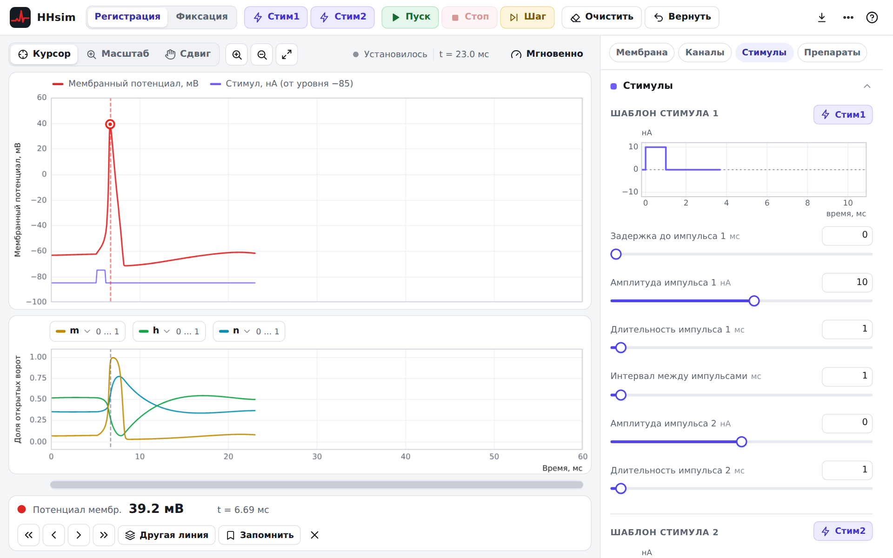

# HHsim — симулятор нейрона Ходжкина–Хаксли (веб-версия)

HHsim — учебная программа по нейрофизиологии. Она показывает, как на мембране нейрона возникает
потенциал действия (спайк), и позволяет менять параметры ионных каналов, мембраны, стимулов,
концентрации ионов и применять препараты, сразу видя результат на графиках. Есть режим фиксации
потенциала (voltage clamp).

Это веб-версия [HHsim 3.7](https://www.cs.cmu.edu/~dst/HHsim/): работает прямо в браузере — на
компьютере, планшете и телефоне, ничего устанавливать не нужно.

**▶ Открыть симулятор:** <https://rem-aster.github.io/HH-sim-redux/>



## Как пользоваться

* Нажмите фиолетовую кнопку **Стим1** — клетка получит импульс тока, и на графике появится спайк
  (красная линия — мембранный потенциал).
* Кнопки **Мембрана**, **Каналы**, **Стимулы**, **Препараты** открывают панели с параметрами справа.
  Измените параметр — моделирование сразу продолжится.
* Щёлкните по любой линии графика, чтобы узнать точное значение в этой точке.
* Переключатель **Фиксация потенциала** вверху включает режим voltage clamp.
* Кнопка **?** открывает краткую справку; подробно — в [руководстве](public/help/index.html)
  и [упражнениях](public/help/exercises.html) (на сайте: `help/index.html`, `help/exercises.html`).

## Что сохранено из оригинала

Модель и численный метод перенесены из HHsim 3.7 без изменений: те же уравнения и параметры каналов,
тот же интегратор (предиктор-корректор с адаптивным шагом), тот же критерий остановки и тот же
алгоритм фиксации потенциала. Автоматические тесты сравнивают траектории веб-версии с исходной
программой (запущенной в GNU Octave) для 18 сценариев — от одиночного спайка до семейства кривых
фиксации потенциала; расхождения — на уровне ошибок округления (< 10⁻⁹).

Весь функционал исходной программы доступен: два шаблона стимулов, непрерывное моделирование
(«Пуск»/«Стоп»), «Шаг», «Очистить», «Запомнить»/«Вернуть», курсор с переходом к экстремумам и между
линиями, три переменные на нижнем графике, масштаб и сдвиг графиков, параметры мембраны, пассивных
и потенциал-зависимых каналов (включая канал пользователя), TTX, TEA и проназа, протоколы фиксации
потенциала с варьируемым параметром, экспорт данных и печать. Названия кнопок совпадают с русской
версией HHsim, поэтому подходят и прежние методички.

Нового: современный интерфейс со светлой и тёмной темой, работа на телефоне и планшете, подсказки
при наведении на график, клавиатурные сокращения, экспорт в CSV (в том числе для Excel) и в PNG.
Несколько ошибок исходной программы исправлено — список в
[руководстве](public/help/index.html#diff).

## Авторы и лицензия

Авторы оригинала — David S. Touretzky, Mark V. Albert, Nathaniel D. Daw, Alok Ladsariya и
Mahtiyar Bonakdarpour (Университет Карнеги — Меллона, США). Русский перевод интерфейса и справки —
по [русской версии HHsim](https://github.com/rem-aster/HHsim).

HHsim — свободная программа, лицензия [GNU GPL версии 2 или более поздней](COPYING). Разработка
оригинала частично поддержана грантом Национального научного фонда США (NSF) DGE-9987588.

---

## Для разработчиков

Сайт — статический: TypeScript + [Preact](https://preactjs.com/), сборка [Vite](https://vite.dev/).
Графики рисуются на canvas собственным компонентом, внешних библиотек графиков нет.

```sh
npm ci
npm run dev          # локальный сервер разработки
npm test             # тесты модели (сравнение с HHsim 3.7)
npm run build        # сборка в dist/
npm run test:e2e     # сквозные тесты в Chromium (после сборки)
npm run screenshots  # снимки экрана для справки (нужен запущенный npx vite preview)
```

| Путь | Содержимое |
|---|---|
| [`src/model/`](src/model) | Модель: [`engine.ts`](src/model/engine.ts) — перенос `iterate.m`, `find_dV.m`, `vc_iterate.m`, `find_I.m` и др.; [`defaults.ts`](src/model/defaults.ts) — исходные параметры |
| [`src/plot/`](src/plot) | Графики на canvas: оси, прореживание, курсор, масштаб, сдвиг |
| [`src/app/`](src/app) | Состояние приложения, курсор, экспорт, цикл анимации |
| [`src/ui/`](src/ui) | Интерфейс: верхняя панель, графики, панели параметров |
| [`public/help/`](public/help) | Руководство и упражнения |
| [`tests/unit/`](tests/unit) | Тесты модели; [`tests/fixtures/`](tests/fixtures) — эталонные траектории, полученные из исходной программы |
| [`tests/e2e/`](tests/e2e) | Сквозные тесты интерфейса (Playwright) |

### Публикация

Workflow [`.github/workflows/pages.yml`](.github/workflows/pages.yml) при каждом push прогоняет
тесты и собирает сайт, а при push в основную ветку публикует его на GitHub Pages. Один раз
включите публикацию: **Settings → Pages → Build and deployment → Source: GitHub Actions**.

Сайт собирается с относительными путями (`base: './'`), поэтому работает из любого каталога — его
можно разместить и на любом другом статическом хостинге или открыть локально через
`npx vite preview`.
